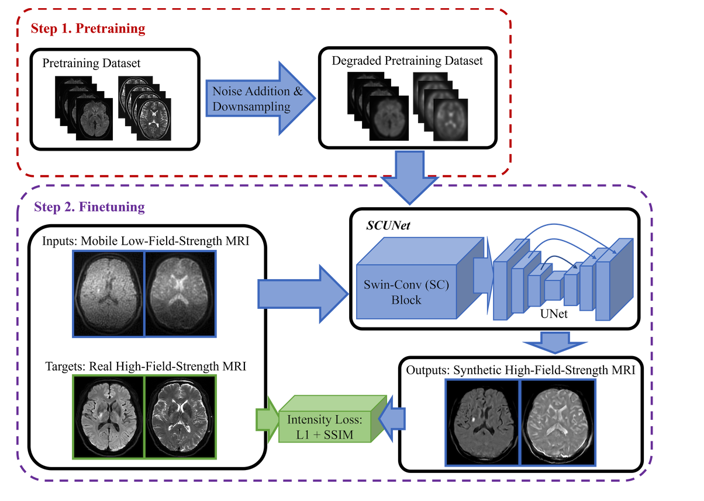
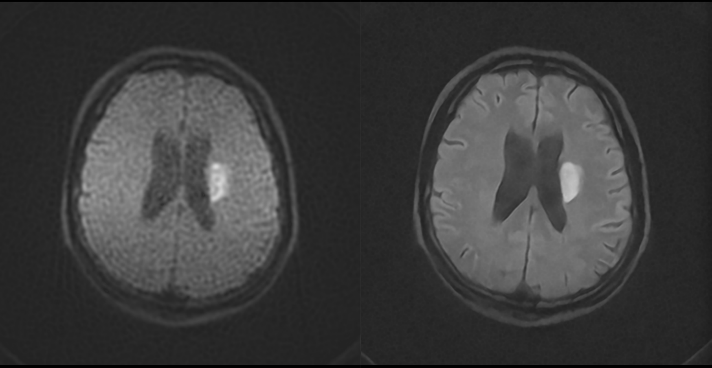

# Quantitative Ischemic Lesions of Portable Low-Field-Strength MRI Using Deep Learning-Based Super-Resolution

## Brief
This is the official implementation of `Quantitative Ischemic Lesions of Portable Low-Field-Strength MRI Using Deep Learning-Based Super-Resolution`. 

This project utilizes the SCUNet (Swin-Conv-UNet) denoising network to enhance low field images, making them comparable to high field images. The project is for research purposes only and cannot be used for commercial purposes.



## Dependencies
- Python 3.8
- PyTorch 1.7
- NVIDIA GPU+[CUDA>11.3](https://developer.nvidia.com/cuda-downloads)

## Usage 
### Environment
```
pip3 install -r requirements.txt
```

### Data Preparation
```
python3 utils/data_proc.py
```
- bias field correction
- image degradation 

We also used synthstrip(from [FreeSurfer](https://surfer.nmr.mgh.harvard.edu/docs/synthstrip/)) to run skull stripping.

### Training / Resume Training
```
python3 main.py --data_dir $DATA_DIR$ --model $MODEL$ --save $SAVE_DIR$
```
### Test/Evaluation
```
python3 main.py --data_dir ~/srdata --save ../experiments --data_test batch1 --model SCUNET --pre_train ../demo.pt --test_only --save_results
```

## Results
For more in-depth results, please refer to the detailed discussion in the paper.


## Acknowledge
The code is built on [SCUNet](https://github.com/cszn/SCUNet), [DAT](https://github.com/zhengchen1999/DAT/tree/main?tab=readme-ov-file).

## Contact
Please feel free to raise an issue on GitHub if you have any questions. 