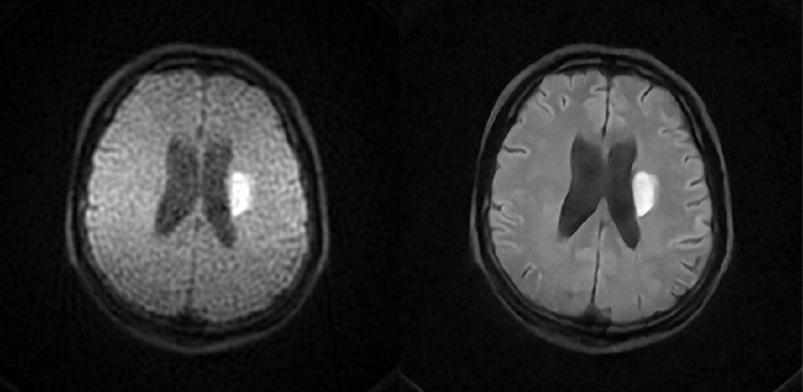

# Quantitative Ischemic Lesions of Portable Low-Field-Strength MRI Using Deep Learning-Based Super-Resolution


## Brief
This is the official implementation of `Quantitative Ischemic Lesions of Portable Low-Field-Strength MRI Using Deep Learning-Based Super-Resolution`. This project utilizes the Swin-Conv-UNet (SCUNet) denoising network to enhance low field images, making them comparable to high field images. 

In this repository, we are committed to following the *[Checklist for Artificial Intelligence in Medical Imaging(CLAIM) 2024 Update](https://pubs.rsna.org/doi/epdf/10.1148/ryai.240300)* to guide our work and practices. By adhering to these guidelines, we aim to contribute to the scientific community with robust and reliable research outputs. Note that the project is for research purposes only. If you intend to use it for any commercial purposes, please contact the authors.


## Dependencies
- Python 3.8
- PyTorch 1.7
- NVIDIA GPU+[CUDA>11.3](https://developer.nvidia.com/cuda-downloads)

## Usage 
### Environment
```
pip3 install -r requirements.txt
```

### Data Preparation
#### Phase 1
Please direct to the pretrain_simulation folder for more details.


Left: the simulated image(after downsampling and adding rician noise) as input; Right: the acquired HR images
#### Phase 2

Phase 2 applied the operations below on the two series(one is acquired from the LF-MRI, and another is acquired from the HF-MRI). 
- ANTs for registration
- bias field correction (SimpleITK N4 Bias Field)
- skull stripping (from [FreeSurfer](https://surfer.nmr.mgh.harvard.edu/docs/synthstrip/)) 

```
python3 utils/data_proc.py
```

### Training / Resume Training
```
python3 main.py --data_dir $DATA_DIR$ --model $MODEL$ --save $SAVE_DIR$
```
### Test/Evaluation
```
python3 main.py --data_dir $DATA_DIR$ --save $SAVE_DIR$ --data_test batch1 --model SCUNET --pre_train ../demo.pt --test_only --save_results
```

## Results
For more in-depth results, please refer to the detailed discussion in the paper.



Left: the PMRI image as input; Right: the SynthMRI image as output

## Acknowledge
The code is built on [SCUNet](https://github.com/cszn/SCUNet), [DAT](https://github.com/zhengchen1999/DAT/tree/main?tab=readme-ov-file). Special thanks to [FastMRI](https://github.com/facebookresearch/fastMRI).

## Contact
If you have any questions, please open an [issue](https://github.com/longw010/Low_Field_Enhancement/issues), and we'll get back to you promptly.
