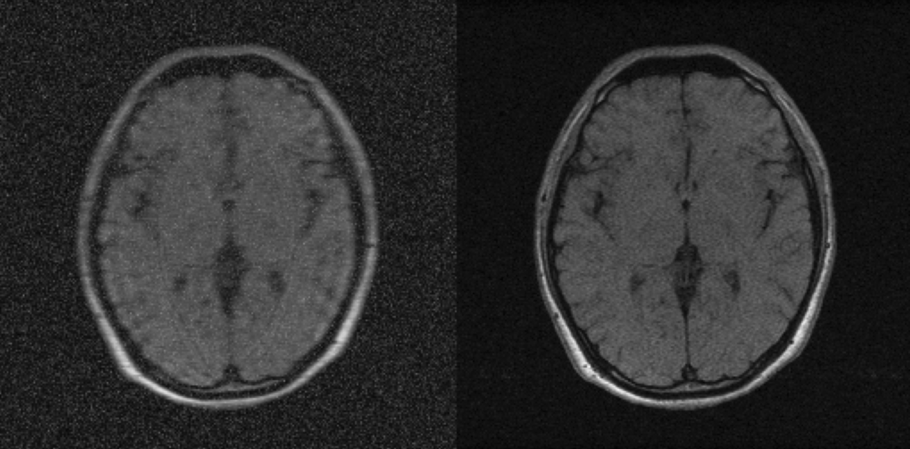

# README

## Brief
The folder is to simulate the pairs for the training phase1. The data is from two public datasets(M4Raw and IXI). 

### Dependencies
* python3.8
* fastmri (note that the package is already downloaded in the repo, so that you can use it directly)
* hdf5 

### Download
* IXI : https://brain-development.org/ixi-dataset/
* M4Raw: https://pan.baidu.com/s/1CqNFMDnrNuXe_qWSyiSA2w?pwd=4mjr  passcode：4mjr

### Example
We prepared a [jupyter-notebook](demo.ipynb) on a sample case to illustrate the detailed steps of the simulation.

Left: the simulated image(after downsampling and adding rician noise) as input; Right: the acquired HR images as output

